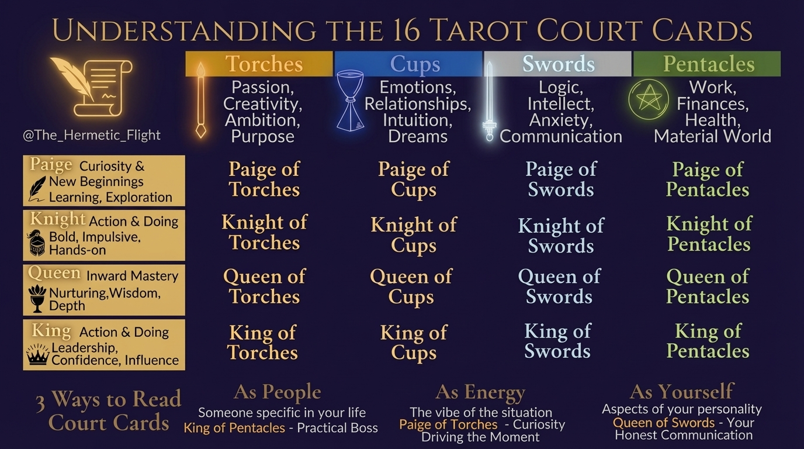

# Court Cards in Tarot Divination: Finally Understanding Pages, Knights, Queens, and Kings

Court cards are a common frustration for tarot readers. They’re vague, tricky to interpret, and often leave you questioning whether they represent a person, energy, or aspect of yourself. Even seasoned readers struggle. As Brigit Esselmont of Biddy Tarot explains, these cards are “the most challenging Tarot cards to understand.”

And honestly – I’m still working on remembering everything myself!
But my hope is that this guide simplifies court cards by breaking them down into manageable parts:

- **Ranks (Page, Knight, Queen, King):** Represent stages of growth and energy expression.
- **Suits (Wands, Cups, Swords, Pentacles):** Define the area of life or energy each card represents.

You’ll learn how to interpret court cards in three ways:
1. As people in your life.
2. As the energy of a situation.
3. As reflections of your own traits.

## Tarot Court Cards Guide: 16 Cards Explained by Rank and Suit

## Court Card Basics: Ranks and Suits

### The 4 Ranks: Pages, Knights, Queens, and Kings

Court cards are divided into four ranks, each symbolizing a unique stage of growth and a distinct way of channeling energy.

- **Pages** represent the spark of curiosity and the excitement of new beginnings. They often signify learning, exploration, or the start of intellectual or creative pursuits.
- **Knights** are the doers - bold, action-oriented, and sometimes impulsive. They learn through hands-on experiences, embodying the qualities of their suit in dynamic, and sometimes extreme, ways.
- **Queens** bring a depth of understanding and maturity to their suit's energy. They focus inward, offering wisdom, nurturing, and personal insight to those around them.
- **Kings** are the masters of their domain, projecting their suit's energy outward with authority and confidence. They lead with decisiveness, using their expertise to shape and influence the world around them.

**REMEMBER:** It’s important to let go of traditional gender roles when interpreting these cards. The energy of a card is tied to its traits, not its gender.

### The 4 Suits: Torches, Cups, Swords, and Pentacles

The suits define the area of life or energy each court card represents:

- **Torches (Fire):** Passion, ambition, creativity, and a sense of purpose.
- **Cups (Water):** Emotions, relationships, intuition, and dreams.
- **Swords (Air):** Logic, communication, intellect, and the challenges of mental processes, including anxiety.
- **Pentacles (Earth):** The material world, including work, finances, health, and physical well-being.

### How Suit and Rank Work Together

The true essence of a court card emerges from the combination of its rank and suit. For instance:

- The **Queen of Swords** blends emotional maturity with intellectual sharpness, offering clear and insightful guidance.
- The **Knight of Pentacles** combines determined action with practicality, reflecting someone hardworking and detail-oriented, though sometimes overly focused on minutiae.
- The **Page of Cups** mixes youthful curiosity with emotional openness, creating a figure who approaches relationships with trust and vulnerability, though sometimes naively.
- The **King of Torches** merges leadership with creative vision, forming a charismatic and inspiring presence who motivates others to take bold action.

## Learn Tarot Court Cards - the Pages, Knights, Queens, and Kings

### 3 Ways to Read Court Cards

Court cards are like chameleons - they shift their meaning depending on your question, the card's placement, and the surrounding cards. By exploring these three key approaches, you can adapt their interpretation to suit the context of your reading. Each method offers a distinct lens to deepen your understanding.

### Court Cards as People in Your Life

One of the simplest ways to interpret a court card is to see it as representing someone specific. The card's rank hints at their approach to life, while the suit reveals their focus or personality traits. For instance, the King of Pentacles might point to a practical, financially savvy boss, while the Knight of Cups could embody a friend who navigates life guided by emotions.

Notice the level of authority (a king is of higher authority than a knight) and how that shifts the relationship dynamic between you and the person or relationship in question. This perspective is particularly useful in relationship readings, where court cards often align naturally with real-life individuals.

### Court Cards as Situation Energy

Sometimes, a court card isn't about a person at all - it’s about the energy of a situation. For example, the Page of Wands might suggest that curiosity and playfulness are driving the moment, while the Knight of Pentacles signals that persistence and effort are key themes. If you’re feeling stuck and draw the Queen of Wands, she could be encouraging you to let go of stress and embrace a more vibrant, playful energy. When the idea of a person doesn’t resonate with your question or the surrounding cards, this approach can provide clarity.

### Court Cards as Parts of Yourself

Court cards can also act as mirrors, reflecting different aspects of your personality. They reveal your strengths, untapped potential, or even traits that might be holding you back. For example, if the Queen of Swords appears during a reading focused on personal growth, she might highlight your ability to communicate with honesty and precision. However, if she’s reversed, it could be a nudge to soften harsh words or overly critical tendencies. These cards often show how you’re embodying - or resisting - a particular energy. Identifying which part of yourself is at play can unlock deeper self-awareness.

Here’s a helpful way to approach court cards: combine the card's rank, suit, and your own intuition to determine whether it represents a person, a situation, or an aspect of yourself. Let the context of your reading guide you in choosing the interpretation that feels most aligned. Court cards are rich with possibilities - use them to their fullest potential.

## Solving Common Court Card Problems

Court cards can often feel tricky to interpret, leaving you second-guessing their meanings. Many tarot readers agree that these cards are some of the most challenging to work with in the deck. However, with a few focused approaches, you can cut through the confusion and find clarity.

### How to Tell If It's a Person or a Situation

Start by looking at where the court card shows up in your spread. If the position is meant to represent "another person" or "external influences", it’s likely pointing to someone in your life. On the other hand, if the position focuses on "your energy" or "what you need to embody", the card is more likely reflecting a situation or a part of yourself.

The surrounding cards can also provide helpful context. For instance, if you see relationship-focused cards like the Two of Cups or The Lovers nearby, the court card may represent a specific person. But if the other cards are about actions, challenges, or emotions - like the Five of Pentacles or the Eight of Swords - the court card might be highlighting situational energy instead.

Brigit Esselmont, the founder of Biddy Tarot, offers this advice:

> "The simplest way to interpret the Court Cards is as the person asking the question – so, the querent or the client. Not someone else – unless the card is drawn in the position that clearly refers to another person".

When the card’s role still feels unclear after considering its position and context, there are additional strategies to help you find clarity.

### What to Do When the Meaning Isn't Clear

If a court card feels contradictory or vague, go back to the basics. Think about its rank (Page, Knight, Queen, or King) and its suit (Wands, Cups, Swords, or Pentacles). Then, let your intuition weave these elements together.

Sometimes, the issue lies in the question itself. If your original question is too broad or layered, try refining it. For example, instead of asking, "Should I move in with my boyfriend or someone else?" you might ask, "What might I experience if I move in with my boyfriend?" A clearer question can often lead to a more precise interpretation.

If you’re still stuck, draw one or two additional cards to narrow down whether the court card represents a person, a personality trait, or advice. Another helpful technique is to describe the card’s traits out loud or write them down. If you’re reading for someone else, share the personality characteristics and ask if the card reminds them of anyone in their life. If you’re reading for yourself, brainstorm possible meanings - like whether the card reflects a coworker or suggests you need to be more assertive - and see which interpretation feels most fitting.

Don’t forget to pay attention to reversed court cards. A reversal can indicate internalized energy, a trait you’re still developing, or a blocked quality that needs attention. Recognizing this can often unlock the meaning of a card that initially felt unclear.

### Connecting Court Cards to Real Life

Once you’ve worked through these strategies, tying court cards to real-life examples can further strengthen your understanding.

One exercise is to lay out all 16 court cards and assign a real-world example to each one. Think of people you know - friends, family, coworkers, or even celebrities - whose personalities align with each card. This practice can help solidify the traits and energy of each court card in your mind.

Another reflective method is the "When am I this court card?" exercise. Look back on moments in your life when you embodied the energy of a specific card. For instance, maybe you were the Page of Pentacles when starting a new job, eager to learn and full of curiosity. Or perhaps you channeled the Queen of Wands during a big project, exuding confidence and determination.

For a more playful approach, try the "speed-dating" exercise. Pick two court cards at random and imagine them meeting at a coffee shop or a social event. Write out the conversation they might have. This can help you explore how different court card personalities interact with each other.

Finally, practice reading for others as much as possible. Often, the person you’re reading for will immediately recognize the traits or individuals the cards describe, which can clarify the meaning for you as well. Keep in mind that every reading is unique - interpretations depend on the situation, the surrounding cards, and the overall context. With time and consistent practice, your ability to interpret court cards will grow sharper and more intuitive.

## Conclusion

### Key Points to Remember

Court cards become much easier to interpret when you combine their rank (Page, Knight, Queen, or King), suit (Wands, Cups, Swords, or Pentacles), and your intuition. These cards can symbolize people in your life, the energy influencing a situation, or even parts of your own personality that could use some attention.

Keep in mind, there’s no single “right” way to interpret court cards. Many readers experiment with different methods or mix approaches, eventually developing a style that feels natural and strengthens their connection to the cards.

### How to Practice What You've Learned

Now that you’ve got the basics down, it’s time to put them into action with some hands-on practice.

One of the best ways to get comfortable with court cards is to connect them to real people in your life. Think about friends, family members, coworkers, or even public figures who embody the traits of each of the 16 court cards. This makes their meanings more relatable and easier to remember.

Reflect on your own experiences. Recall times when you’ve acted like the curious Page starting a new venture or the assertive Queen stepping into leadership. By linking the cards to your personal life, they shift from abstract symbols to familiar, practical tools.

And don’t be afraid to experiment. Try out different questioning techniques in your readings, mix traditional meanings with your own insights, and notice which court cards you feel most drawn to. Regular practice will help you move beyond memorization and develop a deeper, more intuitive understanding of the cards.

## FAQs

×

**How do I know if a court card represents a person or a situation in my tarot reading?**

To figure out whether a court card is pointing to a person or a situation, start by examining the context of the reading. Think about the question being asked, the cards surrounding it, and the overall theme of the spread. While court cards often represent people, they can just as easily highlight personality traits, roles, or energies shaping a particular scenario.

Consider this: Does the card bring to mind someone specific, or does it feel more like it's describing a dynamic or event? For instance, a Page might suggest a message or the start of something new, while a Queen could embody nurturing energy or someone significant in your life. Let both your intuition and the narrative unfolding in the cards guide you.

×

**How can I practice interpreting tarot court cards effectively?**

One practical approach to mastering court cards is linking each one to someone you know or a well-known figure. By doing this, you can tie the card's traits and personality to real-world examples, making them easier to remember and interpret. Another helpful exercise is to imagine a conversation or interaction between two court cards. This can shed light on how their energies might play off each other, offering insights into their dynamics and relationships.

When working with court cards, try to determine whether the card symbolizes a person, a personality trait, or a specific situation in the reading. Trust your instincts and allow yourself to explore various interpretations as you continue to practice. With time and experience, you'll build a stronger connection to their meanings and how they function in different contexts.

×

**Why are court cards so difficult to interpret in tarot readings?**

Court cards often present a challenge in tarot readings because they don’t always deliver a clear, direct message. Instead, they tend to embody personality traits, roles, or even specific situations, making their interpretation heavily reliant on the context of the reading. This can leave them feeling a bit elusive or open-ended.

One way to approach court cards is to view them as archetypes or energies. They might represent someone in your life, reflect a part of your own personality, or point to a particular dynamic within a situation. By paying close attention to their placement within the spread and the influence of nearby cards, you can start to piece together their deeper significance with more confidence.