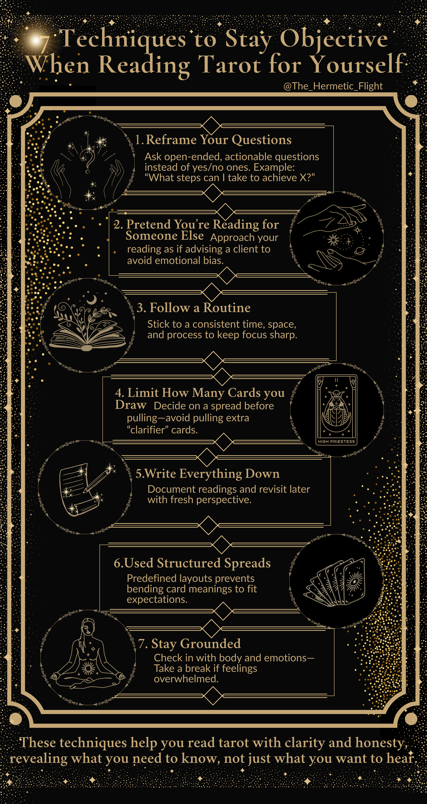

# Reading Tarot Divination for Yourself: 7 Techniques to Stay Objective

Reading tarot for yourself can be tricky - your emotions often get in the way, leading to biased interpretations. To get clear, reliable insights, you need strategies to separate your feelings from the cards' messages. Here are seven practical techniques to help you stay objective:

- **Reframe Your Questions:** Ask open-ended, actionable questions instead of yes/no ones. Example: "What steps can I take to achieve X?"
- **Pretend You're Reading for Someone Else:** Approach your reading as if you're advising a client to avoid emotional bias.
- **Follow a Routine:** Stick to a consistent time, space, and process to keep your focus sharp.
- **Limit How Many Cards You Draw:** Decide on a spread before you start and avoid pulling extra cards to "clarify."
- **Write Everything Down:** Document your readings and revisit them later with a fresh perspective.
- **Use Structured Spreads:** Predefined layouts help prevent you from bending card meanings to fit your expectations.
- **Stay Grounded:** Check in with your body and emotions - take breaks if you're feeling overwhelmed.

These steps help you read tarot with clarity and honesty, ensuring the cards reveal what you need to know, not just what you want to hear.

## 7 Techniques to Stay Objective When Reading Tarot for Yourself

### How to read tarot for yourself (without bias)

### 1. Rewrite Your Question Before You Pull Cards

The first step to staying objective during a tarot reading is crafting clear, thoughtful questions. How you phrase your question can shape the entire reading. Vague or overly simplistic questions often invite confusion, while well-structured ones pave the way for meaningful insights. Before shuffling your deck, take a moment to refine your question for clarity and purpose.

Steer clear of yes/no questions like "Will I get the job?" Tarot isn't designed for simple binary answers. Instead, try asking, "What steps can I take to improve my chances of getting this job?" or "What challenges might I encounter in this process?" These open-ended questions encourage deeper exploration and shift your focus from seeking validation to uncovering actionable guidance. This thoughtful approach to questioning lays the groundwork for interpreting your cards more consistently.

> "Asking biased questions leads to biased answers. Likewise, asking objective questions will lead to objective answers." – Lorriane Anderson

Adding specific timeframes can also make your questions more effective. For example, replace "Will I be happy?" with "What might be the biggest obstacle to my happiness over the next three months?" Questions that begin with "How can I..." or "What do I need to know to..." often yield practical, actionable advice. By framing your question within a clear timeframe, you prepare yourself for a more focused and unbiased reading.

Before you pull cards, take a moment to acknowledge any personal attachments or expectations. Saying something like, "I recognize my desire to hear X, but I remain open to the true message", can help you separate your wishes from the insights the cards reveal.

This disciplined approach to framing your questions is the foundation for receiving clear and unbiased guidance through tarot.

### 2. Read the Cards as If They're for Someone Else

One way to keep your tarot readings unbiased is to approach them as though you're reading for a client. This mindset shift helps you step away from personal emotions - like fears, hopes, or expectations - that can skew your interpretation. When you're emotionally tied to an outcome, it's easy to soften difficult messages, look for "better" cards, or twist their meanings to align with what you want to hear.

> "Then pretend you are reading for another person. It's difficult but possible." – Beth Turnage, Reading tarot for 50 years

To put this into practice, treat yourself as you would a paying client. Set aside a specific time for the reading, create a calm and inviting space, and take a moment to clear your mind with a short meditation. (If you are the kind of person who enjoys listening to sound healing music during meditation, please check out our founder Deirdre's album she recorded with Zachariah Grace as The Reiki Goddess. Their album "Awaken" travels through all seven chakras and is infused with Reiki healing energy, binaural beats, and sound healing to help you ease into a higher brain wave state to effectively channel divine information.) Record your reading to ensure you’re giving yourself the same care and attention you’d give someone else.

Speak your interpretation out loud. Imagine explaining your thoughts to an invisible client sitting across from you. Some readers even use small physical cues - like sitting in a different chair or using a specific notebook - to reinforce the feeling of reading for someone else.

When you finish, ask yourself,
> "Would I interpret these cards the same way if they were for a stranger?"

This question can help catch any lingering bias. Stick to your initial insights and resist the urge to pull extra "clarifier" cards. Viewing the reading from an outsider’s perspective ensures your insights remain clear and objective.

### 3. Build a Consistent Reading Routine

Once you've embraced reading from an outsider's perspective, the next step is to establish a consistent routine. Why? Because reading tarot only when the mood strikes can lead to interpretations clouded by personal emotions. A structured routine helps you build the discipline to separate your feelings from the messages in the cards. This means sticking to the same time of day, using the same space, and following a set pre-reading ritual.

Start with a simple ritual that signals, "This is reading time, not time to overthink." Choose a dedicated space, take a few calming breaths, and shuffle the deck briefly. These small but intentional steps create consistency, helping you focus and prepare your mind for an unbiased reading.

> "So many times we just throw a few cards for ourselves and end up rushing our way through, without treating ourselves or the cards with the respect we deserve." – Brigit Esselmont, Founder of Biddy Tarot

Another powerful addition to your routine is keeping a reading journal. Write down the date, your question, the cards you draw, your interpretation, and any timeframes you associate with the reading. Then, review your entries regularly - monthly or quarterly works well. Interestingly, a 2009 study revealed that regular tarot users often turn to the cards during challenging times as a way to reflect and bring order to their thoughts. Your journal can help you notice patterns, refine the types of questions that yield the clearest insights, and even identify biases you may not have realized were influencing your readings.

Treat your routine like a formal session. When you approach your deck the same way each time, you’re less likely to let fleeting emotions - like today’s stress or tomorrow’s excitement - distort the cards' messages. By standardizing your process, you ensure that the objectivity you've worked to develop becomes an integral part of your tarot practice.

### 4. Decide How Many Cards to Pull Before You Start

Before you even touch your deck, make a firm decision about how many cards you’ll draw. This simple step can help you avoid any unconscious bias during your reading. Whether you’re going with a single card, a classic three-card spread, or something more intricate, having a set plan keeps you from bending the reading to fit a desired outcome.

Here’s why this matters: imagine you pull three cards, but the message doesn’t sit well with you. You might be tempted to grab another card as a "clarifier", and before you know it, you’ve drawn several cards, convincing yourself that the reading aligns with what you wanted to hear. By deciding on your spread in advance, you create a structure that reinforces objectivity.

> "I always know in advance of shuffling, what my question is and how I want it answered... whatever it may be, I always know in advance and ask the cards to show me the answer to my question using the desired spread." – Amber Stagliano, clairvoyant

Match your card count to the complexity of your question. If you’re looking for quick guidance, stick to 1–3 cards. For deeper, more layered questions, opt for a spread with 7–10 cards. Choosing your spread ahead of time not only keeps you focused but also helps maintain the objective mindset you’ve been working to develop.

The most important part? Commit to your decision. If you feel the urge to draw more cards, pause for a moment and reflect. Often, the need for clarity comes from refining your question, not from adding more cards to the reading. Trust the spread you chose and the initial message - it’s the best way to ensure a clear and unbiased reading.

### 5. Write Down Your Readings and Review Them Later

Keeping a written record of your readings can be a game-changer when it comes to staying objective. By documenting your interpretations, you create a reference point that’s less likely to be swayed by fleeting emotions. This habit not only adds clarity but also helps you approach your readings with a cooler head when you review them later. Emotional reactions, after all, can sometimes cloud the true message of the cards.

Here’s the trick: jot down your thoughts and then take a break. Many experienced readers swear by this approach. Melissa M shares her process: "One way that I have found around this is to do a spread (whichever one is applicable), write down all the placements and set it aside for an hour or so. I then go back and read what's there where I don't have as much emotion invested, with 'fresh eyes' so to speak". That pause can be incredibly revealing, allowing insights to surface that you might have missed in the heat of the moment.

Even when a card feels puzzling, its meaning often becomes clearer over time. Madhavi Ghare offers a helpful tip: "Here's what I do when I do encounter a card that just doesn't make any sense (at that point, anyhow) – I write it down in my Journal (the card, and the placement in the spread) so I don't forget about it. The card then remains at the back of my mind, and then somewhere down the line, a few days later, the whole point of the card just pops into my head". Writing things down ensures nothing gets lost and gives your subconscious time to connect the dots.

Treat your self-readings with the same seriousness you’d give to a client. Jack of Wands emphasizes this: "This forces me to provide the same level of care and attention to my own readings as I do to others'". By writing a detailed analysis as if explaining it to someone else, you naturally adopt a more objective and thorough perspective.

Looking back at your past entries can be incredibly rewarding. It helps you spot patterns, refine your interpretations, and strengthen your skills. Plus, it keeps you honest. Once you’ve documented a reading, you’re less likely to tweak it to fit what you want to hear. As you compare your initial impressions with how events actually played out, you’ll gain confidence in your abilities and avoid the temptation to redo readings until you get a preferred outcome.

### 6. Use Specific Spreads with Defined Card Positions

Selecting a spread before shuffling keeps your reading focused and objective. Without a clear plan, it’s easy to interpret cards in ways that align with your biases or preconceived ideas. A pre-designed spread with defined positions gives each card a specific role, making it harder to manipulate meanings to suit your expectations.

Each position within a spread acts as a guidepost. For example, in a three-card spread representing the past, present, and future, the middle card must reflect the present - it can’t suddenly take on a different meaning just because the message feels uncomfortable. This structure keeps you accountable. As The Wellness Foundry explains:

> "Having a clear-cut spread will keep you in check. As tempting as it may be, don't keep lying cards down until you get the answer you want! Don't completely start reading all over again from the beginning just because you didn't like the answer."

The choice of spread should align with the type of question you’re asking. For daily insights, a single-card draw might be all you need. For more complex decisions, a four-position spread can offer deeper guidance. Natalia Vela, writing for Apartment Therapy, shares her approach to managing anxiety with a four-card layout: one card for "what I can control", another for "what I can't control", a third for "how I can work with what I can control", and a fourth for "what I need to release". This structured method helps her process situations logically, rather than reacting emotionally.

For moments when bias is likely to creep in, specialized spreads can help maintain objectivity. The Mirror Spread, for instance, is designed to confront emotional influences head-on. It assigns positions for "What I want to see", "What I don’t want to see", and "The deeper truth". This layout forces you to address your hopes and fears openly, reducing the chance that they’ll distort your interpretation. Whatever spread you choose, commit to it before shuffling and stick with it throughout the reading.

### 7. Connect with Your Body During the Reading

Just like reframing questions or following a structured routine, staying in tune with your body can help you maintain focus and clarity during a tarot reading. Your physical and emotional state plays a big role in how you interpret the cards. Stress, anxiety, or even physical discomfort can cloud your judgment, so it’s important to pay attention to what your body is telling you.

Before diving into a reading, make sure your basic needs are met. If you’re hungry, tired, or feeling physically tense, take a moment to address those needs - or even reschedule the reading if necessary. A quick grounding exercise can also work wonders. Sit upright, close your eyes, and take a moment to scan your body from head to toe. Notice any areas of tension, and with each exhale, imagine releasing that tension. Inhale calm and focus until you feel centered. This practice only takes a minute but can make a big difference. Once you’re grounded, stay mindful of any emotional or physical shifts that might signal the need for a break.

> "When and if you feel yourself get panicked, anxious, restless, unsure, or confused by a self-reading, this is your sign to pause." – MaKayla McRae, Astrology Editor, Parade

If you notice feelings of panic, overwhelm, or strong emotions while working with the cards, it’s okay to step away. Your body might be telling you that you’re too emotionally involved to interpret the cards clearly in that moment. Remember, the cards aren’t going anywhere. Taking a break can lead to clearer insights later, rather than forcing yourself to push through the reading while emotionally foggy.

Deep breathing is another simple but powerful tool to manage emotional intensity. It helps you reset and approach the cards with a clear, objective mindset. As The Wellness Foundry advises:

> "Reading while you're stressed can muddy the energies. So, ensure you're coming in from an objective and open place"

Listen to your body - it will let you know when it’s time to continue.

## Conclusion

Staying objective is key to gaining accurate insights during tarot self-readings. Techniques like reframing your questions, viewing situations from an outsider’s perspective, maintaining a consistent routine, setting a fixed number of cards, journaling your interpretations, using structured spreads, and paying attention to your physical responses can help you approach readings with clarity.

Blending these techniques can further enhance your objectivity. For instance, setting clear intentions, working with a structured spread, and journaling your thoughts combine to create a system that minimizes personal biases. This layered approach helps ensure your readings are both clear and reliable.

Ultimately, a balanced and unbiased approach turns self-readings into a powerful tool for self-discovery. Not every method will resonate with everyone. Some find clarity by imagining they’re reading for someone else, while others prefer the structure of defined spreads or the reflective nature of journaling. Experiment with different strategies to find what helps you step back from emotional influences and truly understand the messages the cards offer.

The aim isn’t to detach completely from your personal connection to the cards - that connection is what makes self-readings meaningful. Instead, it’s about creating enough distance between your emotions and your interpretations so the cards can reveal what you need to know, rather than what you want to hear. With time and practice, these techniques can become second nature, turning your self-readings into an honest and enlightening journey of self-discovery.

## FAQs

**How can I stay objective when reading tarot for myself?**

Staying neutral during a self-tarot reading can be tricky, but with a little mindfulness, it’s entirely doable. Begin by recognizing any emotions or preconceived notions you might be carrying before you even shuffle the deck - this awareness sets the tone for a more balanced reading. Make sure your questions are clear and unbiased, aiming for genuine insight rather than answers you’re hoping to hear.

As you interpret the cards, stick to their traditional meanings rather than letting personal desires or fears color your perspective. A helpful trick is to imagine you’re reading for someone else - this mental shift can create a bit of emotional distance. Another great habit? Write down your interpretations. Journaling not only helps you reflect but can also reveal recurring themes or patterns over time.

**How can I phrase my tarot questions to get clearer insights?**

To make the most of your tarot readings, focus on crafting specific, open-ended questions. Avoid yes-or-no inquiries and instead aim for prompts that encourage deeper exploration. For instance, ask questions like: "What should I understand about..." or "How can I navigate...". These types of questions steer the reading toward guidance and reflection, rather than seeking absolute answers. Examples include: "What factors should I consider when making this choice?" or "What energy is influencing this situation right now?". By keeping your questions thoughtful and introspective, you open the door to more insightful and balanced interpretations.

**Why is it helpful to have a regular tarot reading routine?**

Having a consistent tarot reading routine can keep you centered and focused during your sessions. It encourages reliability in your interpretations and helps reduce the impact of personal emotions or biases that might otherwise cloud your judgment.

Sticking to a regular practice also deepens your relationship with the cards, allowing you to approach each reading with greater clarity. Over time, this habit can sharpen your ability to uncover valuable insights and interpret the messages with confidence.
