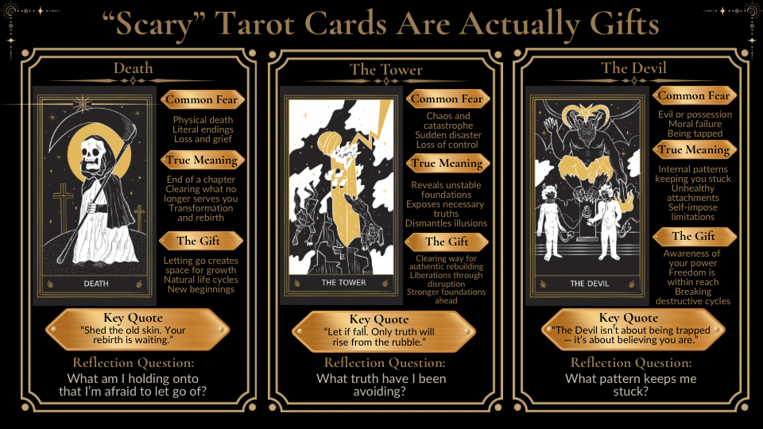

# Death, The Tower, The Devil: Why "Scary" Tarot Divination Cards Are Actually Gifts

Death. The Tower. The Devil. If you’ve ever pulled one of these cards in a tarot reading, you’ve probably felt a jolt of panic. Their intense imagery - skeletons, lightning-struck towers, horned figures - can feel overwhelming. But here’s the truth: these cards aren’t here to scare you. They’re here to help you grow.

These cards often get a bad reputation due to pop culture and literal misinterpretations. But they’re not about doom - they’re about change. Death clears the old to make space for the new. The Tower breaks down unstable foundations so you can rebuild stronger. The Devil shines a light on the chains you have the power to break.

In this guide, we’ll explore why these cards feel so intimidating, how to interpret them in context, and practical ways to work with their energy. You’ll learn how to shift your perspective and see these cards as allies in your personal transformation. Ready to turn fear into empowerment? Let’s dive in.

## Understanding Death, Tower, and Devil Tarot Cards: Meanings and Transformative Gifts

### How to Read Tarot - The "Scary" Tarot Cards, What They REALLY Mean

### Why These Cards Trigger Fear

Certain tarot cards evoke fear due to their dramatic visuals, literal misinterpretations, and the way they’ve been sensationalized in popular culture. A skeleton, a crumbling tower, or a chained figure can cause an instinctive reaction, often bypassing the symbolic meanings these images hold.

> "Pop culture has done a fantastic job of making tarot look terrifying. You see it in movies all the time - someone pulls the Death card, and suddenly, disaster strikes. It's dramatic, sure, but completely misleading."
> — Tarot with Gord [5]

Movies and TV shows have ingrained the idea that these cards spell doom. But tarot isn’t about predicting disasters; it’s more like a mirror, reflecting the cycles and patterns already at play in your life. The real challenge lies in what these cards represent: sudden change, necessary endings, and facing truths we’d rather avoid. Let’s break down how each card stirs up fear in its own way.

### Death: Fear of Endings and the Unknown

Card XIII, commonly misunderstood as a harbinger of physical death, actually represents the end of a chapter and the clearing away of what no longer serves you.

> "More often it points to a death you've already experienced and are grieving, and most often as endings and transitions."
> — Leah Vanderveldt, tarot expert and creator of the Magical Self-Care Tarot Deck [2]

The fear tied to the Death card comes from a natural resistance to change. We hold on tightly to what’s familiar, even when it’s outdated or harmful. This card challenges you to embrace endings as a necessary step toward new beginnings. Rather than signaling loss, Death encourages transformation and growth.

### The Tower: Mistaking Chaos for Catastrophe

The Tower’s striking imagery - dramatic lighting and a falling beauty - can feel overwhelming at first glance. It’s no surprise that the card often triggers anxiety.

The Tower, however, isn’t about causing chaos but revealing it. It exposes the cracks in unstable foundations, dismantles illusions, and clears away what doesn’t align with your truth. When this card appears, it signals that something built on shaky ground is coming apart, making way for a stronger, more authentic structure. While the process can feel unsettling, The Tower’s message is about clearing the way for real transformation. It challenges our attachment to control and stability, forcing us to confront the discomfort of change.

### The Devil: Facing Internal Struggles, Not External Evil

The Devil card, with its horned figure and chained humans, often conjures fears of malevolence, possession, or moral failure. But this surface-level interpretation misses the card’s true meaning. The Devil isn’t about external forces; it’s about the internal patterns that keep us stuck - unhealthy attachments, toxic cycles, and limiting beliefs. The loose chains in traditional depictions remind us that freedom is always within reach.

> "The Devil isn't about being trapped - it's about believing you are."
> — Tarot with Gord [5]

The discomfort this card stirs often comes from confronting parts of ourselves we’d rather avoid - whether it’s addiction, self-doubt, or destructive habits. The Devil asks you to take an honest look at these patterns and recognize your power to break free. While the process may be uncomfortable, it offers the chance for true liberation and self-empowerment.

## How Death, The Tower, and The Devil Serve as Gifts

While these cards can initially feel unsettling, they each carry a profound message of growth and self-awareness. Let’s explore how they guide us through transformation.

### Death: Letting Go to Make Space for Growth

The Death card often appears when you're holding onto something that's no longer serving you. This could be a fading relationship, a stagnant career, or even outdated beliefs about yourself. The card doesn’t cause endings - it acknowledges them and invites you to actively shape what comes next.

> "The Death card signals that one major phase in your life is ending, and a new one is going to start. You just need to close one door, so the new one will open."
> — Labyrinthos [6]

When this card appears, ask yourself: What am I afraid to let go of, and how is it holding me back? The Death card teaches that endings, while difficult, are a natural part of life’s cycles. Think of it like pruning a plant - removing what’s no longer thriving creates space for new growth.

> "The Death card teaches you to let go of outworn and outgrown ways of life and to move forward from them."
> — Biddy Tarot [8]

To work with this card’s energy, try decluttering your space to release emotional baggage, journaling about fears that keep you stuck, or using affirmations like, “I trust in life’s cycles and welcome new beginnings.” Some also find it helpful to meditate on the card before bed and journal any insights from their dreams [7][8][9].

### The Tower: Facing Hard Truths and Rebuilding Stronger

After Death’s lesson of release, The Tower steps in to reveal uncomfortable truths. This card doesn’t create chaos - it exposes what was already unstable. Whether it’s a shaky relationship, a false belief, or an unsustainable situation, The Tower’s collapse forces you to confront what no longer works.

> "The lightning strike represents a sudden realization or awakening, and the crumbling tower symbolizes the breaking down of old patterns and structures. While this can be a painful and challenging process, it is ultimately for our own growth and evolution."
> — Safrianna Lughna, Queer-Spirit Guide [4]

The Tower often brings your shadow self into the spotlight - those parts of you that act out of jealousy, anger, or fear. This isn’t a punishment but an opportunity to understand these patterns and decide if they still serve you. The card’s message is clear: liberation often comes disguised as disruption.

When you draw The Tower, ask: What truth have I been avoiding? It’s an invitation to examine which beliefs or habits are holding you back and whether they align with the life you want to build.

> "Drawing the Tower card signifies that we have an opportunity to confront our beliefs that no longer serve us so we can change our stories. It tells us we can face our shadow, that part of us that keeps us stuck in reactive and often unhelpful behaviors of jealousy, envy, greed, obsessiveness, anger, etc."
> — Joy Reichard, Healing With Joy [10]

To navigate The Tower’s energy, focus on grounding practices like journaling about outdated patterns, staying present during sudden realizations, and welcoming change instead of resisting it. The card clears the way for rebuilding - but only if you’re willing to let the old structure fall [4].

### The Devil: Breaking Free from Limiting Patterns

The Devil shines a light on the patterns and attachments that keep you feeling trapped. Whether it’s an unhealthy relationship, a bad habit, or self-sabotaging behaviors, this card asks you to examine where you’ve given away your power. A key detail in many depictions of The Devil is that the chains are loose - you’re not as stuck as you might think.

This card often appears when you’re operating on autopilot, repeating cycles that limit your growth. Its message isn’t about judgment but awareness. Once you see these patterns clearly, you can make a conscious choice to change them.

> "The Devil card shows us where we’ve been giving our power away and reminds us that freedom is always within reach."
> — Biddy Tarot [8]

When The Devil appears, ask yourself: What am I gaining by staying stuck? Often, there’s a hidden benefit - avoiding responsibility, maintaining a familiar identity, or dodging the discomfort of change. Recognizing these payoffs isn’t weakness; it’s the first step toward reclaiming your power.

Working with The Devil means being honest about your attachments and practicing self-compassion. It’s not about striving for perfection but realizing that the chains holding you back are ones you can remove. Use mindfulness to interrupt destructive cycles and affirmations to remind yourself of your inner strength. The Devil’s ultimate lesson? You have more power than you think - use it to create the life you want.

## Reading These Cards in Context

The meaning of a tarot card isn't static - it shifts depending on its position within a spread. This dynamic approach allows you to explore how these impactful cards guide personal growth. Think of the spread as a map, where each position offers a unique perspective on your question, layering new insights with every placement.

### How Position Changes Meaning: Past, Present, and Future

A card's position can completely reshape its meaning. In the **past position**, cards highlight transitions or influences that have already shaped your current situation but are now fading [11][12][14][15]. For example, Death in this position often points to a significant ending you've already navigated, while The Devil might reveal a toxic pattern or influence that once held sway over your path.

In the **present position**, these cards reflect what you're facing right now [11][13]. Death could signal that you're in the thick of a transformation, The Tower might indicate a sudden upheaval or revelation, and The Devil could point to ongoing struggles with habits or attachments. This is your moment to pause and assess - what's unfolding, and how are you responding?

When placed in the **future**, these cards act as signposts for what might lie ahead if current patterns continue [11][13][14]. Death could hint at an impending ending, The Tower might warn of an upcoming shake-up, and The Devil could suggest a looming choice to break free from limiting patterns. It's important to remember that the future isn't set in stone - these cards are more like guiding lights, urging you to reflect and adjust as needed.

> "The meaning of a Tarot card is made more precise when viewed through the lens of its position in a spread." [11]

### How Neighboring Cards Modify Interpretation

Interpreting a card in isolation only tells part of the story. Skilled readers weave a narrative by examining how cards interact with their neighbors [16][17]. The surrounding cards can completely shift the meaning of intense ones like Death, The Tower, or The Devil. For instance, if The Tower appears alongside The Sun, it might suggest "a blessing in disguise", where upheaval ultimately leads to clarity and renewal [18]. On the other hand, pairing The Devil with The Tower could emphasize more challenging themes, such as "serious consequences tied to addiction" [18].

Look closely at shared symbols - like falling, or recurring colors - and notice how the figures on the cards interact. Are they facing each other, or do they seem to look away? These subtle details can reveal whether the energies are working together or pulling in opposite directions. In some cases, cards like The Devil and The Tower can amplify or soften each other's energy, depending on their positions and connections [18].

### Reading Multiple Intense Cards Together

When multiple intense cards show up in one spread, they often signal a period of profound transformation. Instead of feeling overwhelmed, focus on creating a cohesive narrative by connecting their themes. For example, if you draw Death, The Tower, and The Devil, their combined presence may highlight a major turning point in your life [18]. Use techniques like a bridging exercise to find links between the cards. Look for shared imagery, colors, or recurring objects, and consider how one card might represent an ending while another suggests what needs to be released to move forward [16].

> "Experienced readers do not interpret cards in isolation. Instead, they look at how the cards relate to each other and the story they have to tell." – MJS Tarot [16]

If the intensity feels like too much, take a step back. Sometimes, pulling just one or two clarifying cards can help you focus. Pay attention to the imagery and emotional tone of the cards rather than relying solely on traditional meanings. Journal your first impressions and give yourself time to process before continuing. When multiple intense cards appear, they often carry a concentrated message worth exploring with care and patience.

## Practical Methods for Working with Intense Cards

Now that we’ve explored the nature of these intense cards, let’s dive into practical ways to engage with them. When cards like Death, The Tower, or The Devil appear in your readings, it’s not just about interpreting their meaning - it’s about finding tools to turn their energy into personal growth.

### Reflection Questions for Each Card

Journaling with targeted questions can turn these cards from intimidating symbols into sources of clarity. For Death, ask yourself: "What am I holding onto that I’m afraid to let go of, and why? What part of me fears what’s next?" [20] In matters of love, reflect on: "What needs to be released for me to love with greater freedom and openness?" [20] These prompts guide you to examine what’s no longer serving your evolving identity - be it outdated goals, values, or attachments [8].

When The Tower appears, it’s time to challenge your foundations. Consider: "What kind of freedom is The Tower offering me?" or "Am I holding on too tightly, or is it time to let things fall apart?" [3] Dig deeper by asking: "What truth am I avoiding that could bring clarity, even if it’s disruptive?" [3]

For The Devil, begin with: "What area of my life is this card highlighting?" and "What fears or habits are keeping me stuck?" [19] Imagine befriending your inner demons. Ask yourself: "What part of my shadow self needs acknowledgment and acceptance?" [3]

> "Face your own personal demons, says the Devil." - Tarot Parlor [19]

These reflection questions can help expose negative influences or unhealthy cycles, offering a way to reclaim your power and choose freedom [3]. Once you’ve explored these themes through journaling, structured tarot spreads can provide even more insight.

### Tarot Spreads for Shadow Work and Growth

A simple 3-card Shadow Work Spread is an excellent place to start. Here’s how to position the cards:

1. **Card 1:** Reveals your shadow
2. **Card 2:** Shows the lesson within it
3. **Card 3:** Highlights the gift that lies beyond

For a more in-depth reading, try a 5-card Transformation Spread with these positions:

1. **What must I release?** (Guided by Death’s message)
2. **What truth am I avoiding?** (The Tower’s challenge)
3. **What pattern keeps me stuck?** (The Devil’s reflection)
4. **What strength will help me move forward?**
5. **What awaits after this transformation?**

Dr. Nidhi Bhan from Vedic Life School suggests pairing these spreads with affirmations to reinforce their messages. For Death, she recommends:

> "Shed the old skin. Your rebirth is waiting."
> — Dr. Nidhi Bhan, Vedic Life School [22]

For The Tower, her advice is:

> "Let it fall. Only truth will rise from the rubble."
> — Dr. Nidhi Bhan, Vedic Life School [22]

Approach each reading with intention, asking clear questions that focus on the guidance you need. Keeping a journal of your readings can help you notice recurring patterns and track how these cards repeatedly highlight areas in your life ready for transformation [21].

## Conclusion

Death, The Tower, and The Devil are more than just ominous symbols - they're invitations to embrace transformation. When you shift your mindset from fear to curiosity, these cards evolve into some of the most insightful tools in your tarot practice. They highlight what needs to change, reveal truths you've been avoiding, and uncover patterns that may be holding you back.

Take the example of Mystic Ellie Tarot, who encountered these cards during a pivotal moment in March 2025. Facing a faltering relationship, her reading included The Devil, The Tower, and Death. Initially daunting, the cards instead illuminated a choice: commit to working on the relationship with real effort, or let it go entirely. Reflecting on the experience, she shared:

> "Tarot isn't about predicting doom and gloom. It's a tool for guidance, clarity, and sometimes, a much-needed reality check."
> — Mystic Ellie Tarot [1]

This experience underscores the transformative potential these cards possess.

So, the next time one of these cards appears in your spread, resist the urge to react with dread. Instead, take a moment to understand its message. Death might signify the end of something to make space for growth. The Tower could be urging you to break free from a shaky foundation. The Devil might be exposing a pattern you're ready to release. Each card challenges you to make a choice and take charge of your path.

Approach them with courage, not fear. Let their guidance inspire action and growth. Transformation may be uncomfortable, but it often leads to opportunities you might not have seen otherwise. These cards are here to guide, empower, and help you navigate change with intention.

## FAQs

### Why are cards like Death, The Tower, and The Devil seen as positive in tarot readings?

At first glance, these cards might feel overwhelming, but they hold the potential for profound growth and change. The Death card symbolizes the conclusion of one chapter to create room for fresh starts. The Tower points to unexpected shifts or disruptions that clear out what’s no longer beneficial, offering the chance to rebuild on sturdier ground. The Devil challenges you to confront and release harmful habits or restrictive thought patterns.

Instead of approaching these cards with fear, view them as calls to introspection, growth, and embracing the changes that can lead to renewed strength and personal transformation.

### How can I use cards like Death, The Tower, and The Devil for personal growth?

These cards might feel overwhelming at first glance, but they hold meaningful insights into transformation and personal growth. Instead of viewing them as ominous, try seeing them as symbols of change and opportunities for renewal. Take a moment to think about areas in your life that could benefit from release, restructuring, or a fresh start.

You can connect with the energy of these cards through mindfulness practices, journaling, or meditating on the themes they present. Their messages encourage you to let go of what no longer serves your well-being and to welcome new paths for healing and growth. It’s important to remember that these cards aren’t meant to be warnings - they’re gentle nudges, inviting you to embrace evolution.

### What should I do if I feel overwhelmed by intense tarot cards like Death, The Tower, or The Devil?

If you’re feeling a bit overwhelmed, pause for a moment and take a deep breath. Ground yourself in the present. These cards aren’t here to predict disaster - they’re gentle prompts, encouraging you to explore areas in your life that might benefit from growth, transformation, or change.

Consider journaling about the feelings or thoughts the cards stir within you. Writing can help untangle emotions and bring clarity. Alternatively, meditation can be a powerful way to center yourself and connect with the messages the cards offer. Keep in mind, these cards are simply tools for self-reflection. When approached with an open heart, they can lead you toward healing and meaningful shifts in your journey.

For a powerful meditation experience, check out Awaken by Zachariah Grace and The Reiki Goddess. The entire 7 track album is reiki infused with binaural beats and encompasses all 7 main chakras. This album is available for streaming on all major streaming platforms.
